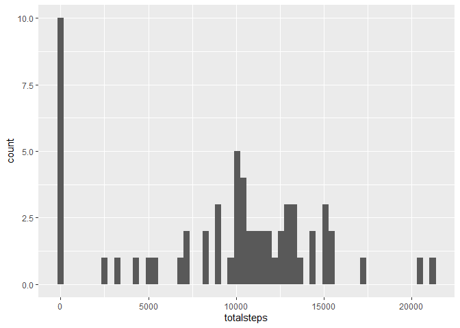
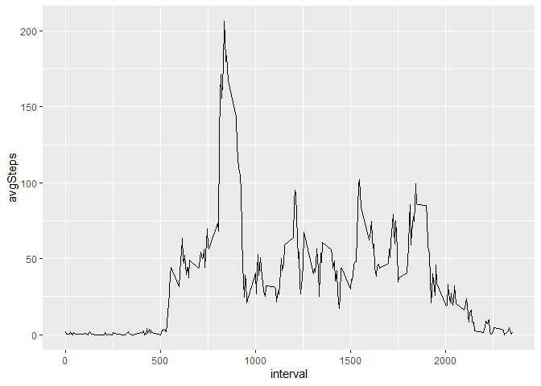
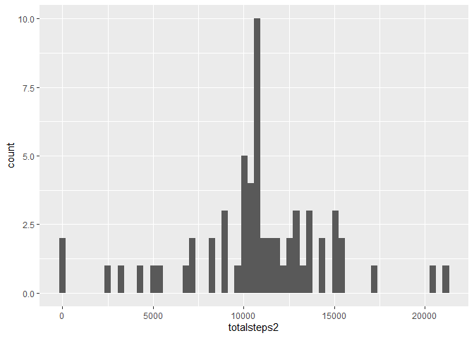
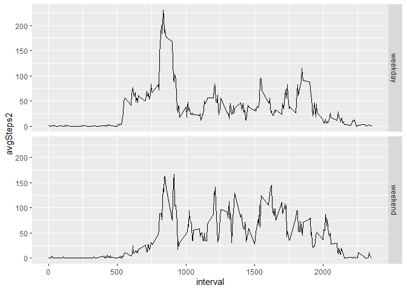

```r
knitr::opts_chunk$set(echo = TRUE)
```

## Part 1 - load and preprocess the data

With working directory as github directory: unzip activity.csv file, read in to object: data


```r
datedownloaded <- date()

activity <- unzip("activity.zip")
data <- read.csv(activity)
```

load required packages


```
## 
## Attaching package: 'dplyr'
```

```
## The following objects are masked from 'package:stats':
## 
##     filter, lag
```

```
## The following objects are masked from 'package:base':
## 
##     intersect, setdiff, setequal, union
```

```
## 
## Attaching package: 'lubridate'
```

```
## The following object is masked from 'package:base':
## 
##     date
```

data processing: convert dates


```r
data$date <- ymd(data$date)
```


## What is the mean total number of steps taken per day?

### Calculate the total number of steps taken per day


```r
dailyStepTot <- data %>% group_by(date) %>% summarise(totalsteps =sum(steps, na.rm=TRUE))
```

### Make a histogram of the total number of steps taken each day 

```r
g <- ggplot(data=dailyStepTot, aes(x=totalsteps))+geom_histogram(bins=60)
g
```

<!-- -->

### Calculate and report the mean and median of the total number of steps taken per day


```r
summary(dailyStepTot$totalsteps)
```

```
##    Min. 1st Qu.  Median    Mean 3rd Qu.    Max. 
##       0    6778   10395    9354   12811   21194
```

```r
d_mean <- as.integer(mean(dailyStepTot$totalsteps, na.rm=TRUE))
d_median <- as.integer(median(dailyStepTot$totalsteps, na.rm=TRUE))
```
- Mean = 9354 steps
- Median = 10395 steps

## What is the average daily activity pattern?

### Make a time series plot of the 5-minute interval (x-axis) and the average number of steps taken, averaged across all days (y-axis)


```r
intAvg <- data %>% group_by(interval) %>% summarise(avgSteps = mean(steps, na.rm=TRUE))

intAvg %>% ggplot(aes(interval,avgSteps))+geom_line()
```

<!-- -->

### Which 5-minute interval, on average across all the days in the dataset, contains the maximum number of steps?


```r
max <- which.max(intAvg$avgSteps)
intAvg[max,]
```

```
## # A tibble: 1 x 2
##   interval avgSteps
##      <int>    <dbl>
## 1      835     206.
```
-interval: 835

## Imputing missing values

### Calculate and report the total number of missing values in the dataset


```r
nMiss <- sum(is.na(data))
nMissDate <- sum(is.na(data$date))
nMissInt <- sum(is.na(data$interval))
nMissSteps <- sum(is.na(data$steps))
print(c(nMiss,nMissDate,nMissInt,nMissSteps))
```

```
## [1] 2304    0    0 2304
```
Thus there are 2304 missing values, all of which are step counts.

### Devise a strategy for filling in all of the missing values in the dataset. The strategy does not need to be sophisticated. For example, you could use the mean/median for that day, or the mean for that 5-minute interval, etc.


```r
mergedData <- merge.data.frame(x=data,y=intAvg,by="interval")
mergedData <- arrange(mergedData, date, interval)

for(i in 1:length(mergedData$steps)){ 
                if(is.na(mergedData$steps[i])) {
                        mergedData$steps[i] = mergedData$avgSteps[i]
                }
}

any(is.na(mergedData))
```

```
## [1] FALSE
```
This strategy imputes the mean for the 5-minute interval, calculated previously. Median may be a better choice for further analysis.

### Create a new dataset that is equal to the original dataset but with the missing data filled in.


```r
data2 <- mergedData[,1:3]
```

### Make a histogram of the total number of steps taken each day and calculate and report the mean and median total number of steps taken per day. Do these values differ from the estimates from the first part of the assignment? What is the impact of imputing missing data on the estimates of the total daily number of steps?

- Mean = Median = 10,766
- This imputation strategy has moved the data towards a more symmetric distribution


```r
dailyStepTot2 <- data2 %>% group_by(date) %>% summarise(totalsteps2 =sum(steps, na.rm=FALSE))

h <- ggplot(data=dailyStepTot2, aes(x=totalsteps2))+geom_histogram(bins=60)
h
```

<!-- -->

```r
summary(dailyStepTot2$totalsteps2)
```

```
##    Min. 1st Qu.  Median    Mean 3rd Qu.    Max. 
##      41    9819   10766   10766   12811   21194
```


## Are there differences in activity patterns between weekdays and weekends?

### Create a new factor variable in the dataset with two levels – “weekday” and “weekend” indicating whether a given date is a weekday or weekend day.


```r
MontoFri <- c("Monday","Tuesday","Wednesday","Thursday","Friday")

for(i in 1:length(data2$date)){
        if(weekdays(data2$date[i],abbreviate=FALSE) %in% MontoFri){
                data2$day[i] = "weekday"
        }
        else {data2$day[i] = "weekend"}
}

data2$day <- as.factor(data2$day)
```

### Make a panel plot containing a time series plot of the 5-minute interval (x-axis) and the average number of steps taken, averaged across all weekday days or weekend days (y-axis). See the README file in the GitHub repository to see an example of what this plot should look like using simulated data.


```r
j <- data2 %>% group_by(interval, day) %>% summarise(avgSteps2 = mean(steps,na.rm = FALSE)) %>% ggplot(aes(interval, avgSteps2))+geom_line()+facet_grid(day~.)

j
```

<!-- -->

- Two noticeable spikes in am/pm on weekday chart
- Activity seems more evenly spread overall on weekends
